# 毕业设计-酒店信息管理系统

#### 介绍
采用后端：spring + springmvc + mybatis，前端：jsp + layui的技术架构，环境环境：jdk1.8 | mysql | maven 的酒店管理系统。可用于酒店住客业务的基本管理。

#### 软件架构
后端：spring + springmvc + mybatis  
前端：jsp + layui  
环境：jdk1.8 | mysql | maven  

#### 功能结构
该系统支持两种不同的身份登入，分别是读者与管理员。不同身份的对应功能如下：
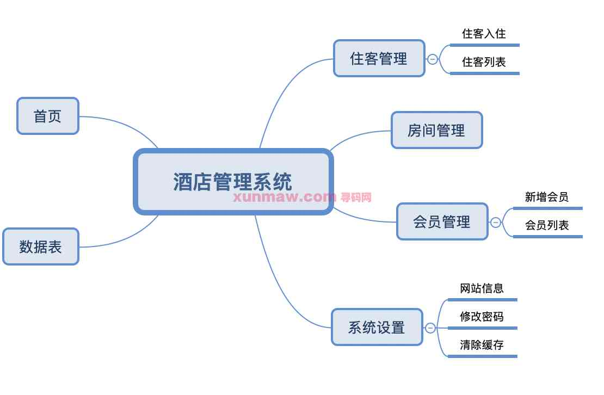

#### 功能介绍
##### 【代码结构与数据库截图】
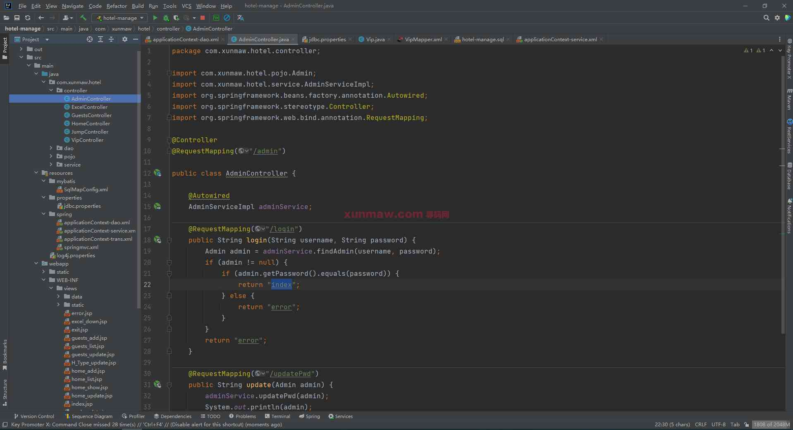
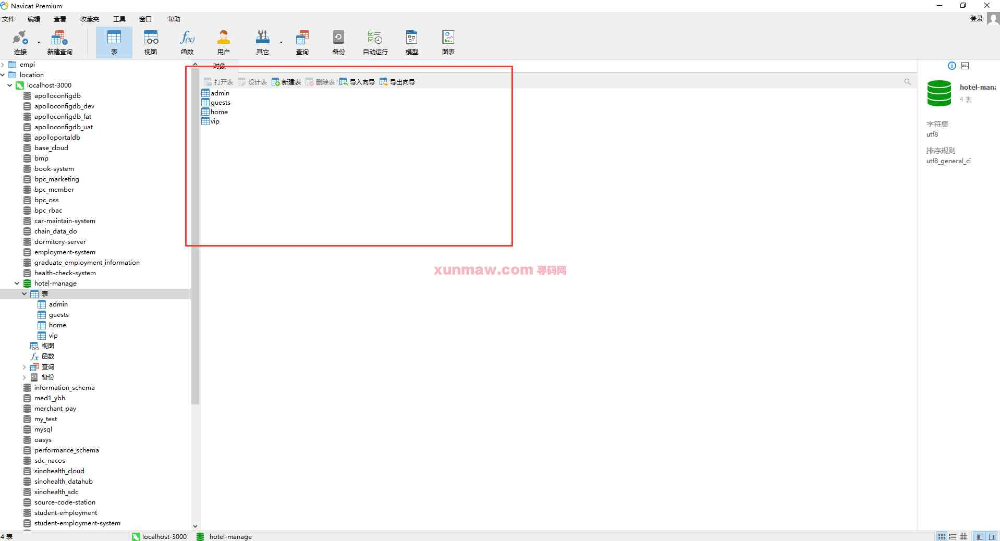

##### 【功能详述】 
在登录界面，填入账号、密码即可登录系统  
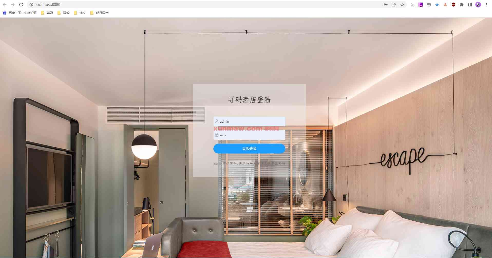

△首页
进入系统后，首页显示系统介绍信息与使用指南。本页面的提示内容可以更改。 
左侧显示各个功能模块的菜单入口。  
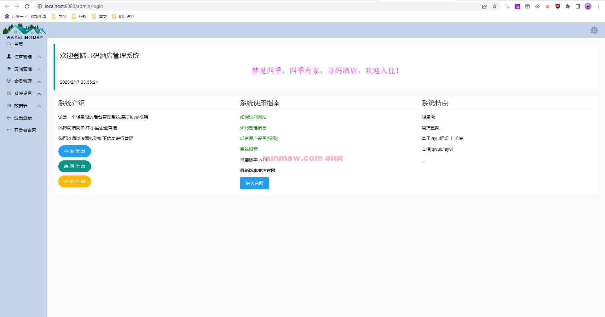

△住客管理
住客管理分为【入住管理】与【住客列表】  
入住管理供添加新住客，填写住客信息、入住时间、退房时间，可以选择房型并入住空闲的房间。  
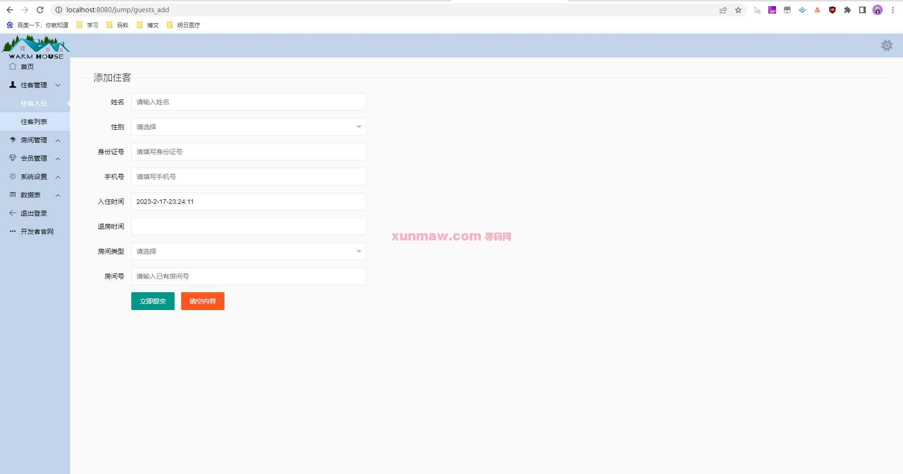
住客列表显示当前的住客与入住情况。支持通过手机号查询住客，可以删除、修改住客信息。
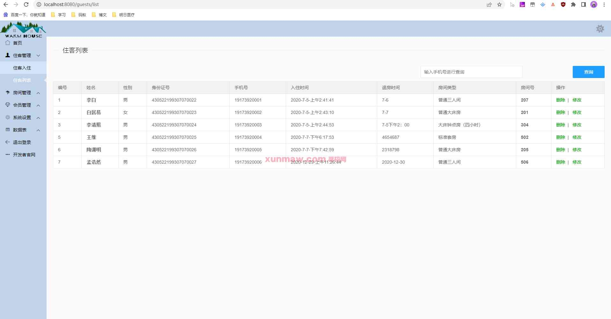

△房间管理
对本酒店的房间情况进行管理，支持添加、删除、修改房间信息。可以查阅并更改房间状态，如空房、未打扫、已入住等。
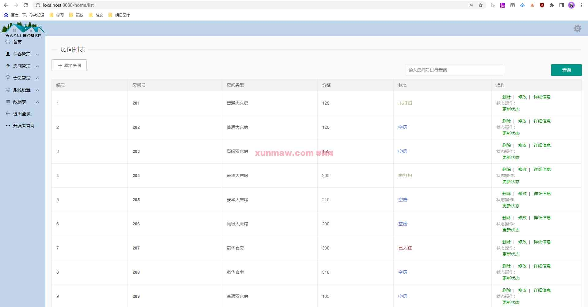

△会员管理
会员管理包含【新增会员】与【会员列表】
在新增会员界面填写信息与会员类型、会员开通时间与到期时间后，即可新增。新增后的会员可在会员列表中查看。
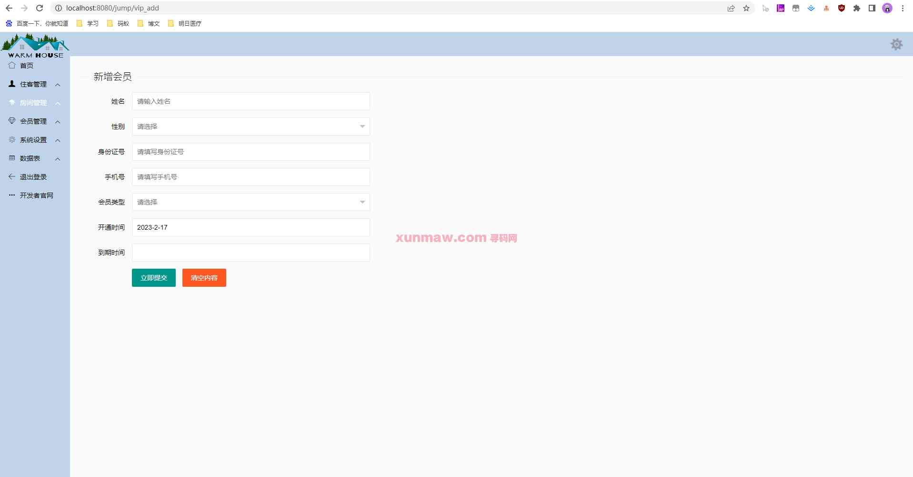
会员列表显示会员信息，支持搜索、删除、修改操作。
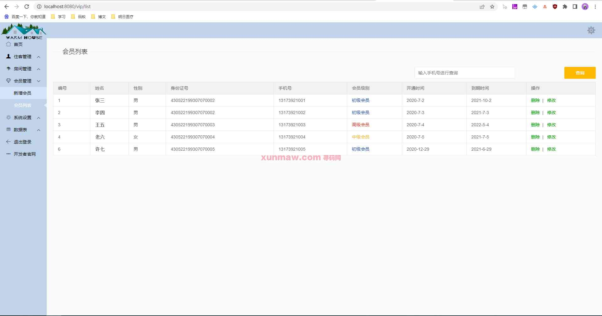

△系统设置
系统设置包含【系统信息】、【修改密码】和【清理缓存】
系统信息中可以修改首页中显示的介绍信息，可以改为本酒店或当前开发者信息。
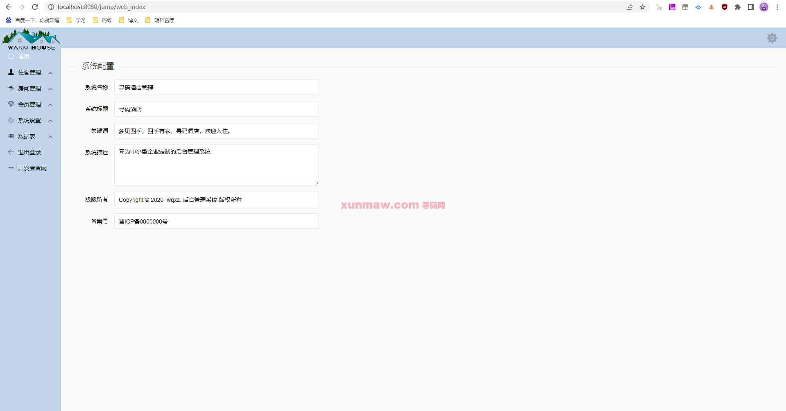
通过修改密码，可以修改当前用户的账号密码。
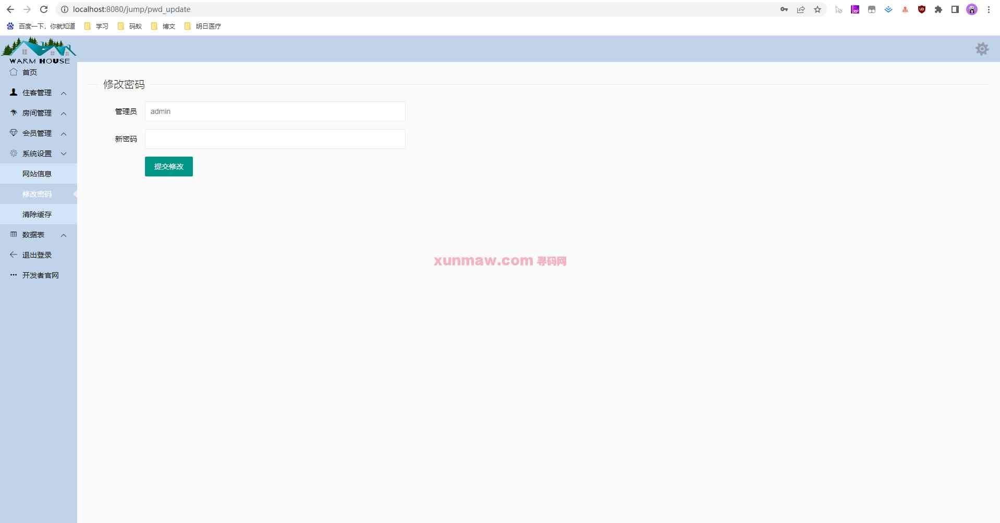

△系统设置
本功能可用于房间信息与住客信息的导出。
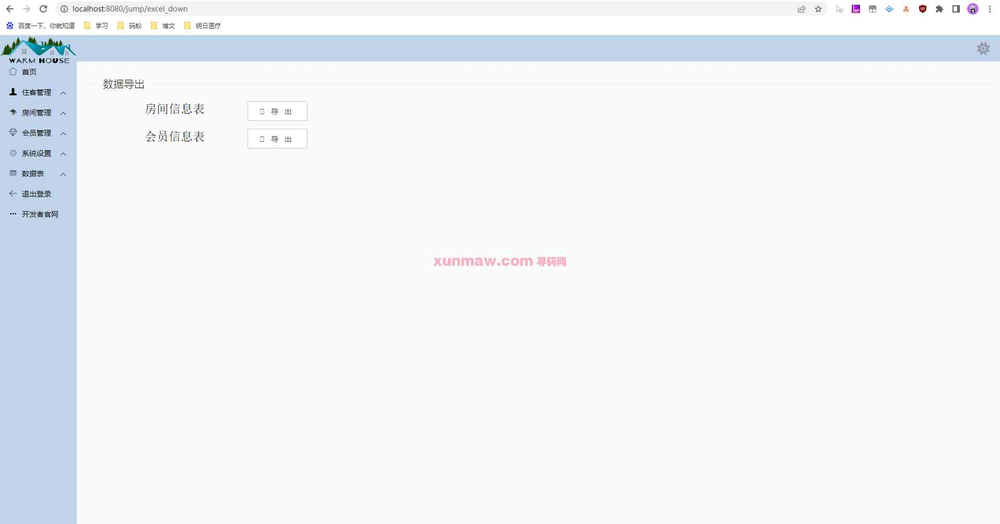

#### 使用说明
1. 创建数据库，执行数据库脚本
2. 修改jdbc数据库连接参数
3. 下载安装maven依赖jar
4. 在tomcat服务器部署项目  
    请求地址： http://localhost:8080/book    
    用户名：admin  
    密码：admin  

#### 联系作者
这是作者的微信二维码，如需本项目源代码，可扫码联系联系作者  

这是作者的公众号二维码，是不是推一些新开发的项目源码与高效软件工具，感兴趣的朋友给个关注  

